<!-- Generated by GitHub Profile Agent Console. Edit profile.config.json, then run npm run generate. -->

  <picture>
    <source media="(max-width: 760px) and (prefers-color-scheme: dark)" srcset="./assets/hero/agent-console-0067faba-mobile-dark.svg">
    <source media="(max-width: 760px)" srcset="./assets/hero/agent-console-0067faba-mobile-light.svg">
    <source media="(prefers-color-scheme: dark)" srcset="./assets/hero/agent-console-0067faba-dark.svg">
    <source media="(prefers-color-scheme: light)" srcset="./assets/hero/agent-console-0067faba-light.svg">
    
  </picture>

  
  
  

  

  
  

  

  

<table bordercolor="#22D3EE">
  <tr>
    <td width="50%" valign="top">
      <h3 align="left">🔐 Themis---Alt</h3>
      
An alternative build of the Themis platform with advanced capabilities. An interactive cyber-awareness and threat-defense platform.

      
<b>Stack:</b> Python · PyTorch · TypeScript · Next.js

      

        
      

    </td>
    <td width="50%" valign="top">
      <h3 align="left">⚖️ Krypts</h3>
      
A modern web application featuring advanced WebGL graphics and DRM capabilities. Placed 1st at MindSpark'26.

      
<b>Stack:</b> React · Next.js · TypeScript · Python

      

        
      

    </td>
  </tr>
</table>

  

  <code>Python</code> <code>PyTorch</code> <code>TensorFlow</code> <code>Scikit-learn</code> <code>TypeScript</code> <code>Next.js</code>

## Recent Activity

<!-- AUTO:ACTIVITY:START -->
_Recent public activity will appear here after the workflow runs._
<!-- AUTO:ACTIVITY:END -->

---

  Simplicity is the soul of efficiency.

