<!-- Generated by GitHub Profile Agent Console. Edit profile.config.json, then run npm run generate. -->

  <picture>
    <source media="(max-width: 760px) and (prefers-color-scheme: dark)" srcset="./assets/hero/agent-console-49937e23-mobile-dark.svg">
    <source media="(max-width: 760px)" srcset="./assets/hero/agent-console-49937e23-mobile-light.svg">
    <source media="(prefers-color-scheme: dark)" srcset="./assets/hero/agent-console-49937e23-dark.svg">
    <source media="(prefers-color-scheme: light)" srcset="./assets/hero/agent-console-49937e23-light.svg">
    
  </picture>

  
  
  

  

  
  

  

  

  
  

  

  <code>Python</code> <code>PyTorch</code> <code>TensorFlow</code> <code>Scikit-learn</code> <code>TypeScript</code> <code>Next.js</code>

## Recent Activity

<!-- AUTO:ACTIVITY:START -->
_Recent public activity will appear here after the workflow runs._
<!-- AUTO:ACTIVITY:END -->

---

  Simplicity is the soul of efficiency.

